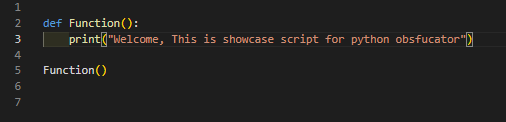
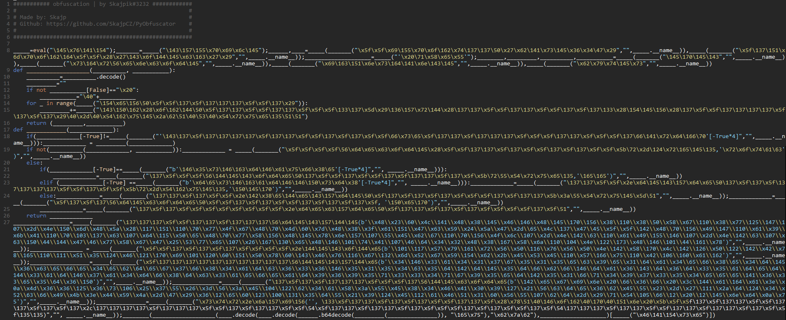

# Python Obfuscator
### by Skajpik#3232
<br><br>
- Obsfucates into unreadable text
- Bypasses antiviruses

<br><br>

# Showcase

<br>

### No Obfuscation


<br>

### With Obfuscation


<br><br>

# Installation

```
git clone https://github.com/SkajpCZ/PyObfuscator
cd PyObfuscator
pip install -r requirements.txt
python3 Obfuscator.py
```